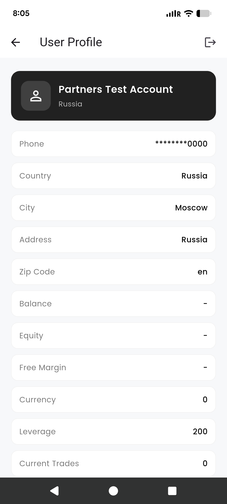
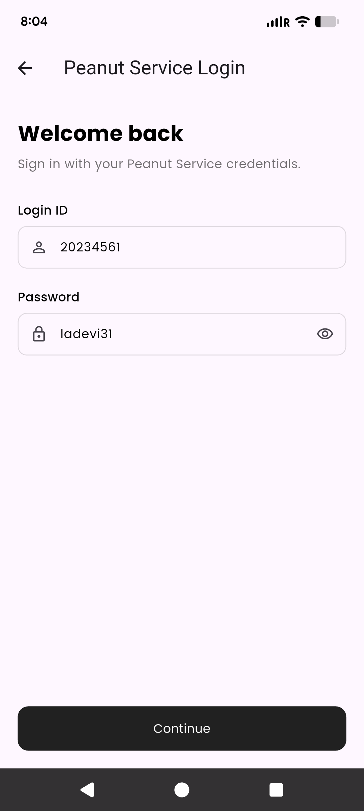
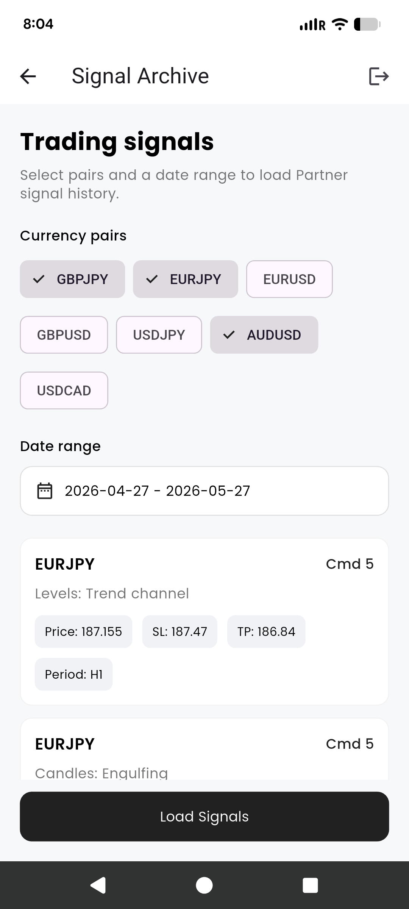
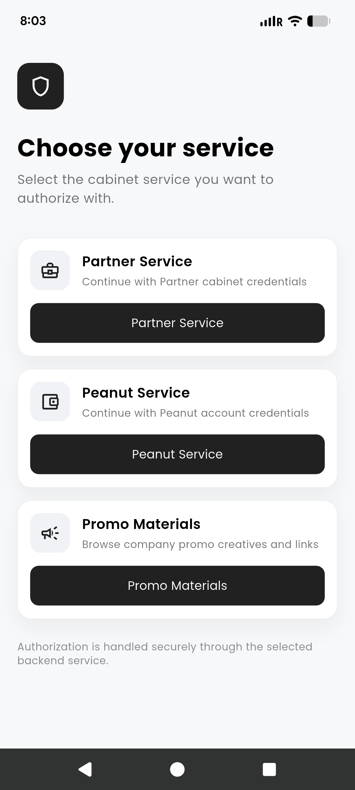
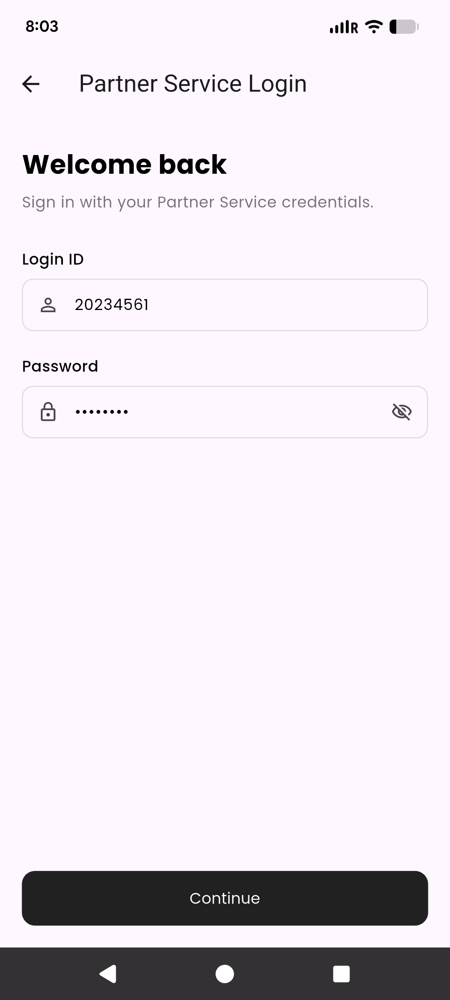

# Aitek Task

Flutter implementation for Peanut Service authorization, Partner Service authorization, user profile retrieval, trading signal archive, and promo materials.

## Screenshots

  
  
  
  
  

## Reusable Verification Module Flow

The authentication and verification-related flows were organized as self-contained feature modules under `lib/feature`. Each backend flow has its own directory and owns its UI, state, use cases, repository contracts, repository implementations, data sources, request params, and response models.

Implemented modules include:

- `authentication/peanut_service`: verifies Peanut credentials and stores the Peanut login ID/token.
- `authentication/partner_service`: verifies Partner credentials and stores the Partner login ID/token.
- `user_profile`: uses the stored Peanut session to load account information and phone data.
- `partner_signal_archive`: uses the stored Partner session to load trading signal history.
- `promo_materials`: retrieves and displays SOAP-based company promo materials.

This structure makes the flows reusable because each feature can be moved or shared with another app with minimal coupling. The host app only needs to provide shared dependencies such as networking, cache, dependency injection, and navigation entry points.

## Architectural Approach Used

The project follows a Clean Architecture-style separation:

- `presentation`: screens, cubits/blocs, UI state
- `domain`: entities, repositories, use cases
- `data`: remote/local data sources, DTOs, repository implementations
- `core`: networking, cache, dependency injection, navigation helpers, shared widgets

State management is handled with `flutter_bloc` Cubits. Each feature exposes predictable states such as loading, success, and failure. API communication is isolated in remote data sources, while screens only interact with Cubits.

The shared `DioClient` centralizes API behavior, including timeout handling, error mapping, logging, base URL construction, and connectivity checks before every POST request. SOAP parsing for promo materials is kept inside the promo materials data layer.

## Dependency Isolation And Navigation Flow

Dependency isolation is handled through `get_it` in `core/di/service_locator.dart`. Features depend on abstractions such as repository interfaces and data source interfaces instead of directly constructing dependencies. Shared services such as `DioClient`, `ConnectivityService`, and `ICacheRepository` are registered once and injected where needed.

Session data is isolated in `ICacheRepository`. Peanut and Partner sessions are stored separately so one flow does not overwrite the other:

- Peanut session: login ID and token for profile APIs.
- Partner session: login ID and token for signal archive APIs.

Navigation is centralized through `AppNavigator`. The app starts from a session-aware flow in `main.dart`:

- If a Partner session exists, it opens `PartnerSignalArchiveScreen`.
- Else if a Peanut session exists, it opens `UserProfileScreen`.
- Otherwise, it opens `LandingScreen`.

The `LandingScreen` acts as the module entry point and routes users to Peanut login, Partner login, or Promo Materials. Logout clears the stored session and redirects back to the landing screen.
